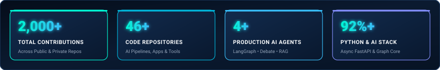

  

    

  

    

  
  
  
  

   

  > *"Bridging deterministic software engineering with stochastic LLMs to build reliable, autonomous agentic systems."*

---

## 📌 Executive Summary

**Specialized in architecting autonomous multi-agent systems and high-throughput Generative AI infrastructure.** Focused on converting non-deterministic Large Language Models into reliable, enterprise-ready software pipelines through **stateful graph orchestration (LangGraph)**, **hybrid RAG pipelines**, and **real-time streaming async architectures**.

- 🤖 **Multi-Agent Orchestration & Consensus:** Engineered complex multi-agent deliberation topologies (Advocate-Skeptic-Manager debates, Supervisor-Worker networks) and self-healing cyclic graphs with bounded state machines.
- ⚡ **Deterministic Guardrails & Structured Output:** Eliminating hallucinations through schema-enforced Pydantic validation, dynamic context routing, and Human-in-the-Loop (HITL) checkpoints.
- 🚀 **Scalable Async & Real-Time Streaming:** Architecting distributed FastAPI backends with sub-second Server-Sent Events (SSE), Redis rate-limiting/caching, and PostgreSQL GIN/Vector indexing.
- 🛡️ **Multi-Model Resilience:** Implementing production failover cascades across Groq (Llama 3.1), OpenAI, and HuggingFace to ensure zero-downtime reliability.

---

## 🧠 Core Competencies & Technical Skills

  

 

### 🤖 Agentic AI & Multi-Agent Systems

### ⚡ Generative AI, LLMs & Vector Intelligence

### 🛠️ Backend, APIs & Distributed Architecture

### 💾 Databases & Caching Layer

### 🌐 Frontend & Full-Stack Interfaces

### ⚙️ DevOps, Containers & Testing

---

## 🌟 Featured Agentic & Generative AI Projects

### 1. 💼 [CareerPilot AI](https://github.com/Qadeer572/CareerPilotAI) — Autonomous Multi-Agent Career Platform
**Multi-Agent Debate Pipeline • LangGraph • FastAPI • Redis • PostgreSQL • Groq / Hugging Face**

- **Multi-Agent Consensus Engine**: Implemented an automated 3-agent deliberation loop (**Advocate**, **Skeptic**, and **Hiring Manager**) streaming real-time debates via Server-Sent Events (SSE).
- **Stateful Readiness Graph**: Built an end-to-end LangGraph evaluation pipeline combining ATS optimization, resume parsing (`Llama 3.1 8B`), deterministic skills gap analysis, and tailored interview prep.
- **Enterprise-Grade Backend**: Features tenant isolation, Redis-backed rate limiting (SlowAPI), multi-model fallbacks (Groq ➔ HuggingFace), and GIN-indexed structured JSON data.

  

---

### 2. 🔬 [Autonomous Research Assistant](https://github.com/Qadeer572/Research_Assistant) — Multi-Agent Intelligence Engine
**LangGraph • FastAPI • Multi-Source Research • Real-time SSE • Human-in-the-Loop**

- **Multi-Source Autonomous Agent**: Orchestrates real-time web research (Tavily), arXiv academic paper parsing, and NewsAPI retrieval using cyclic LangGraph state machines.
- **Human-in-the-Loop (HITL) Controls**: Allows users to inspect, approve, or redirect the agent's research scope at critical graph breakpoints.
- **Automated Synthesis & Publishing**: Generates structured executive summaries and compiles multi-format publication-ready documents (PDF via ReportLab & DOCX).

  

---

### 3. 🎙️ [Voice AI Agent](https://github.com/Qadeer572/voice_ai_agent) — Real-Time Conversational Voice Assistant
**Python • Speech Pipelines • LLM Function Calling • Low-Latency Audio Streaming**

- **Low-Latency Voice Pipeline**: Integrated speech-to-text (STT), LLM reasoning, dynamic tool execution, and text-to-speech (TTS) for natural, sub-second vocal interactions.
- **Context-Aware Tool Calling**: Enables the voice agent to trigger external APIs and retrieve contextual data in real-time during conversations.

---

### 4. 🏥 [AI Surgery Rescheduler](https://github.com/Qadeer572/AI_Project_B) — Heuristic AI Optimization System
**Python • A* Search Algorithm • Machine Learning • Streamlit Dashboard**

- **Intelligent Rescheduling**: Solves high-constraint medical resource conflicts by deploying **A* Heuristic Search** to dynamically rearrange elective surgeries during emergency surges.
- **Predictive ML Model**: Estimates emergency surgery probabilities to pre-allocate hospital capacity and reduce patient wait times.

---

## 🏗️ How I Architect Agentic Systems (Design Philosophy)

  

 

1. **Deterministic State over Pure Autonomy**: Unbounded agent loops fail in production. I build finite state machines (FSMs) with explicit entry/exit conditions and typed state models.
2. **Evaluator-Optimizer Feedback Loops**: Agents independently verify critical outputs before finalizing execution, ensuring hallucination rates are minimized.
3. **Graceful Degeneracy & Multi-Model Cascades**: Production systems shouldn't break when a provider experiences downtime or rate limits. I implement automatic failover routing (e.g. Groq ➔ OpenAI ➔ HuggingFace).

---

## 📊 Engineering Impact & Contributions

  

 

  
  

 

  

---

## 💼 Why Hire Me? (Value Proposition for Recruiters)

- 🚀 **Full-Cycle AI Engineering**: From prompt and agent graph design to Dockerized, secure, multi-tenant API deployment.
- 💡 **Deep Focus on Reliability**: I specialize in preventing hallucinations, enforcing structured JSON schemas, and implementing deterministic guardrails.
- ⚡ **Rapid Prototyping to Production**: Proven ability to take agentic ideas from architecture diagrams to tested, real-time streaming products.
- 🤝 **Clear Communication & Autonomy**: Capable of driving AI initiatives independently or collaborating closely with cross-functional engineering teams.

---

## 📬 Let's Connect & Hire Me!

I am actively exploring **Full-Time, Contract, and High-Impact Roles** including:
- **Agentic AI Engineer / Multi-Agent Systems Developer**
- **Generative AI & LLM Application Engineer**
- **Full-Stack AI Engineer / AI Backend Developer**

 

📧 **Email:** [razaqadeer572@gmail.com](mailto:razaqadeer572@gmail.com) &nbsp;|&nbsp; 🌍 **Location:** Available for Remote & Global Opportunities

